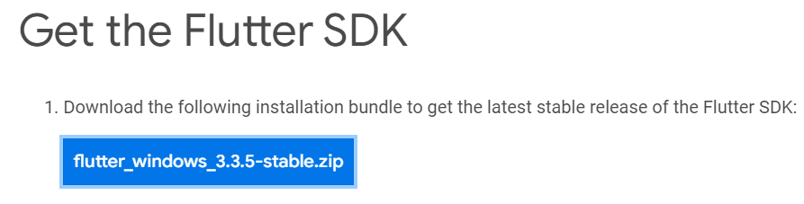

# Flutter - Google

Mobile App Development
(Cross-platform)


## Introduction to Flutter


Flutter is an open source framework to create high quality, high performance mobile applications across mobile operating systems - Android and iOS. It provides a simple, powerful, efficient and easy to understand SDK to write mobile application in Google's own language, Dart.

Flutter is Google's portable UI toolkit for crafting beautiful, natively compiled applications for mobile, web, and desktop from a single codebase. Flutter works with existing code, is used by developers and organizations around the world, and is free and open source.

## Flutter Framework

Provides utility & Functions (Widgets / UI Elements).

## Dart (The Programming Languages)

Enables compilation to native 32-bit and 64-bit ARM code for iOS and Andriod.

## Flutter SDK(Software Development Kit)

Set of tools need to build and Test Apps.

## Installation

1. Click the below link to install `Flutter`.

```dart
https://docs.flutter.dev/get-started/install
```



2. Download the above pack.

3. Set the bin path of your flutter in `environment variables`.

   For Example :

   ```dart
   C:\flutter\bin
   ```

4. Then you should run the `flutter doctor` command, then it'll display some requirements to install.

```dart
flutter doctor
```

For Example :

```dart
[-] Android toolchain - develop for Android devices
• Android SDK at D:\Android\sdk
✗ Android SDK is missing command line tools; download from https://goo.gl/XxQghQ
• Try re-installing or updating your Android SDK,
  visit https://docs.flutter.dev/setup/#android-setup for detailed instructions.

```

5. We should install those dependencies and again run the `flutter doctor` command

6. Then we should agree to flutter android licenses, by running the command

```dart
flutter doctor --android-licenses
```

## Best Tool and recommended Tool for Flutter :

## Android studio(Recommended) :


## Visual Studio Code(Best Tool):


# Let's Start our Creations

1. Open the `VS Code` in your machine.

2. Click `Ctrl + Shift + P` to open command palette.

3. Select `Flutter:New Project`.

4. Then select the flutter template you want `Application`.

5. And select the project location and create your flutter project.

6. Inside the `lib` folder open the `main.dart` file start your code.

# Entry point


```dart
//Entry point

void main(){
}
```

## Debugging Flutter APPS :

- It is a suite of performance and profiling tools run on a browser. Logging: Logging view widget Inspector working in DevTools and also indirectly from the Android Studio & IntelliJ. The inspector allows checking the visual representation of widget trees.

- In VS Code we found this debuggging toolbar.
  

## Hot Reload :


A code change has a visible effect only if the modified Dart code is run again after the change. Specifically, a hot reload causes all the existing widgets to rebuild. Only code involved in the rebuilding of the widgets is automatically re-executed. The main() and initState() functions, for example, are not run again.

## How to perform a hot reload

    1. Run the app from a supported Flutter editor or a terminal window. Either a physical or virtual device can be the target. Only Flutter apps in debug mode can be hot reloaded.

    2. Modify one of the Dart files in your project. Most types of code changes can be hot reloaded; for a list of changes that require a hot restart, see Special cases.

    3. If you’re working in an IDE/editor that supports Flutter’s IDE tools, select Save All (cmd-s/ctrl-s), or click the hot reload button on the toolbar.

    4. If you’re running the app at the command line using flutter run, enter r in the terminal window.

After a successful hot reload operation, you’ll see a message in the console similar to:

```dart
Performing hot reload...
Reloaded 1 of 448 libraries in 978ms.
```

## Hot Restart :


### Perform Hot Restart:

Run your flutter editor from the app or using the command prompt. Once your flutter project has been created do some changes in your code and perform a hot restart. You can perform a hot restart using the hot reload button or pressing `ctrl+shift+\`.

## Widgets :


Widgets are the central class hierarchy in the Flutter framework. A widget is an immutable description of part of a user interface. Widgets can be inflated into elements, which manage the underlying render tree. Widgets themselves have no mutable state (all their fields must be final).

### There are two types of widgets :

    1. Stateful Widget and
    2. Stateless Widget

## Stateful Widget :

In VS Code by typing `stful` command to create an stateful widget.

```dart
// Flutter Stateful Widget

class MyApp extends StatefulWidget {
  const MyApp({ super.key });

  @override
  State<MyApp> createState() => _MyAppState();
}

class _MyAppState extends State<MyApp> {
  @override
  Widget build(BuildContext context) {
    return Container(color: const Color(0xFFFFE306));
  }
}
```
