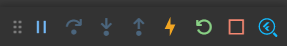
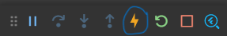

# Flutter - Google

Mobile App Development
(Cross-platform)


## Introduction to Flutter


Flutter is an open source framework to create high quality, high performance mobile applications across mobile operating systems - Android and iOS. It provides a simple, powerful, efficient and easy to understand SDK to write mobile application in Google's own language, Dart.

Flutter is Google's portable UI toolkit for crafting beautiful, natively compiled applications for mobile, web, and desktop from a single codebase. Flutter works with existing code, is used by developers and organizations around the world, and is free and open source.

## Flutter Framework

Provides utility & Functions (Widgets / UI Elements).

## Dart (The Programming Languages)

Enables compilation to native 32-bit and 64-bit ARM code for iOS and Andriod.

## Flutter SDK(Software Development Kit)

Set of tools need to build and Test Apps.

## Installation

1. Click the below link to install `Flutter`.

```dart
https://docs.flutter.dev/get-started/install
```


2. Download the above pack.

3. Set the bin path of your flutter in `environment variables`.

   For Example :

   ```dart
   C:\flutter\bin
   ```

4. Then you should run the `flutter doctor` command, then it'll display some requirements to install.

```dart
flutter doctor
```

For Example :

```dart
[-] Android toolchain - develop for Android devices
• Android SDK at D:\Android\sdk
✗ Android SDK is missing command line tools; download from https://goo.gl/XxQghQ
• Try re-installing or updating your Android SDK,
  visit https://docs.flutter.dev/setup/#android-setup for detailed instructions.

```

5. We should install those dependencies and again run the `flutter doctor` command

6. Then we should agree to flutter android licenses, by running the command

```dart
flutter doctor --android-licenses
```

## Best Tool and recommended Tool for Flutter :

## Android studio(Recommended) :


## Visual Studio Code(Best Tool):


# Let's Start our Creations

1. Open the `VS Code` in your machine.

2. Click `Ctrl + Shift + P` to open command palette.

3. Select `Flutter:New Project`.

4. Then select the flutter template you want `Application`.

5. And select the project location and create your flutter project.

6. Inside the `lib` folder open the `main.dart` file start your code.

# Entry point


```dart
//Entry point

void main(){
}
```

## Debugging Flutter APPS :

- It is a suite of performance and profiling tools run on a browser. Logging: Logging view widget Inspector working in DevTools and also indirectly from the Android Studio & IntelliJ. The inspector allows checking the visual representation of widget trees.

- In VS Code we found this debuggging toolbar.
  

## Hot Reload :




A code change has a visible effect only if the modified Dart code is run again after the change. Specifically, a hot reload causes all the existing widgets to rebuild. Only code involved in the rebuilding of the widgets is automatically re-executed. The main() and initState() functions, for example, are not run again.

## How to perform a hot reload

    1. Run the app from a supported Flutter editor or a terminal window. Either a physical or virtual device can be the target. Only Flutter apps in debug mode can be hot reloaded.

    2. Modify one of the Dart files in your project. Most types of code changes can be hot reloaded; for a list of changes that require a hot restart, see Special cases.

    3. If you’re working in an IDE/editor that supports Flutter’s IDE tools, select Save All (cmd-s/ctrl-s), or click the hot reload button on the toolbar.

    4. If you’re running the app at the command line using flutter run, enter r in the terminal window.

After a successful hot reload operation, you’ll see a message in the console similar to:

```dart
Performing hot reload...
Reloaded 1 of 448 libraries in 978ms.
```

## Hot Restart :


### Perform Hot Restart:

Run your flutter editor from the app or using the command prompt. Once your flutter project has been created do some changes in your code and perform a hot restart. You can perform a hot restart using the hot reload button or pressing `ctrl+shift+\`.

## Widgets :


Widgets are the central class hierarchy in the Flutter framework. A widget is an immutable description of part of a user interface. Widgets can be inflated into elements, which manage the underlying render tree. Widgets themselves have no mutable state (all their fields must be final).

### There are two types of widgets :

    1. Stateful Widget and
    2. Stateless Widget


## Stateful Widget :

- Stateful Widgets: The widgets whose state can be altered once they are built are called stateful Widgets. These states are mutable and can be changed multiple times in their lifetime. This simply means the state of an app can change multiple times with different sets of variables, inputs, data

- In VS Code by typing `stful` command to create an stateful widget.

```dart
// Flutter Stateful Widget

class MyApp extends StatefulWidget {
  const MyApp({ super.key });

  @override
  State<MyApp> createState() => _MyAppState();
}

class _MyAppState extends State<MyApp> {
  @override
  Widget build(BuildContext context) {
    return Container(color: const Color(0xFFFFE306));
  }
}
```

## Stateless widget :

- Stateless Widget: The widgets whose state can not be altered once they are built are called stateless widgets. These widgets are immutable once they are built i.e any amount of change in the variables, icons, buttons, or retrieving data can not change the state of the app.

- In VS Code by typing `stless` command to create an stateless widget.

```dart
// Flutter Stateless Widget
class GreenFrog extends StatelessWidget {
  const GreenFrog({ super.key });

  @override
  Widget build(BuildContext context) {
    return Container(color: const Color(0xFF2DBD3A));
  }
}
```

## Run App :

The runApp() function takes the given Widget and makes it the root of the widget tree. In this example, the widget tree consists of two widgets, the Center widget and its child, the Text widget. The framework forces the root widget to cover the screen, which means the text “Hello, world” ends up centered on screen.

This is the main method to run our app.

```dart
import 'package:flutter/material.dart';

void main() {
// run app
  runApp(
    const Center(
      child: Text(
        'Hello, world!',
        textDirection: TextDirection.ltr,
      ),
    ),
  );
}
```

## Material App

`MaterialApp()` Class: MaterialApp is a predefined class in a flutter. It is likely the main or core component of flutter. We can access all the other components and widgets provided by Flutter SDK.

```dart

// Material App
MaterialApp(
// theme
  theme: ThemeData(
    brightness: Brightness.dark,
    primaryColor: Colors.blueGrey
  ),
  home: Scaffold(
    appBar: AppBar(
      title: const Text('MaterialApp Theme'),
    ),
  ),
)
```

## Home property :

`home:` It is used for the default route of the app means the widget defined in it is displayed when the application starts normally. Here we have defined the Scaffold widget inside the home property. Inside the Scaffold we define various properties like appBar, body, floatingActionButton, backgroundColor, etc.

## Text widget :

The Text widget displays a string of text with single style. The string might break across multiple lines or might all be displayed on the same line depending on the layout constraints.

```dart
Text('Ruban', style: TextStyle(fontSize: 20,),),
```

## Container() :

Container class in flutter is a convenience widget that combines common painting, positioning, and sizing of widgets. A Container class can be used to store one or more widgets and position them on the screen according to our convenience. Basically, a container is like a box to store contents.

```dart
Center(
  child: Container(
    margin: const EdgeInsets.all(10.0),
    color: Colors.amber[600],
    width: 48.0,
    height: 48.0,
  ),
)
```

## Row and Column :

- Row and Column are two of the most commonly used layout patterns.

- Row and Column each take a list of child widgets.

- A child widget can itself be a Row, Column, or other complex widget.

- You can specify how a Row or Column aligns its children, both vertically and horizontally.

- You can stretch or constrain specific child widgets.

- You can specify how child widgets use the Row’s or Column’s available space.


 

```dart
// Row

Row(
  mainAxisAlignment: MainAxisAlignment.spaceEvenly,
  children: [
    Image.asset('images/pic1.jpg'),
    Image.asset('images/pic2.jpg'),
    Image.asset('images/pic3.jpg'),
  ],
);
```

```dart
// Column

Column(
  mainAxisAlignment: MainAxisAlignment.spaceEvenly,
  children: [
    Image.asset('images/pic1.jpg'),
    Image.asset('images/pic2.jpg'),
    Image.asset('images/pic3.jpg'),
  ],
);
```

## Child

`child:`. The child contained by the container. If null, and if the constraints are unbounded or also null, the container will expand to fill all available space in its parent, unless the parent provides unbounded constraints, in which case the container will attempt to be as small as possible.

```dart
Container(
// child
    child: Text('Hey Google'),
)
```

## Children

`children[]`. A child widget can itself be a Row , Column , or other complex widget. You can specify how a Row or Column aligns its children, both vertically and horizontally. You can stretch or constrain specific child widgets. You can specify how child widgets use the Row 's or Column 's available space.

```dart
Column(
// children
    children: <Widget>[
        Text('abc'),
        Text('xyz'),
    ]
)
```

## Floating Action button

Each component in Flutter is called a widget, and FloatingActionButton is no exception. As the name suggests, this widget floats on top of other widgets on the screen. Usually, the FloatingActionButton widget is placed in the bottom-right corner of the screen and is circular in shape.

when you using the button widgets, you must add `onPressed:` event.

```dart
// Floating Action Button

      floatingActionButton: FloatingActionButton(
        onPressed: () {
          // you can add your onPressed code here!
        },
        child: const Icon(Icons.add),
      ),
```

## Icons :

An icon is a graphic image representing an application or any specific entity containing meaning for the user. It can be selectable and non-selectable. For example, the company's logo is non-selectable. Sometimes it also contains a hyperlink to go to another page.

```dart
children: const <Widget>[
// Icons
    Icon(
      Icons.favorite,
      color: Colors.pink,
      size: 24.0,
      semanticLabel: 'Text to announce in accessibility modes',
    ),
    Icon(
      Icons.audiotrack,
      color: Colors.green,
      size: 30.0,
    ),
    Icon(
      Icons.beach_access,
      color: Colors.blue,
      size: 36.0,
    ),
  ],
```

## Icon button:

An icon button is a picture printed on a Material widget that reacts to touches by filling with color (ink). Icon buttons are commonly used in the AppBar. actions field, but they can be used in many other places as well. If the onPressed callback is null, then the button will be disabled and will not react to touch.

```dart
// Icon Button

IconButton(
            icon: const Icon(Icons.android),
            color: Colors.white,
            onPressed: () {},
          ),
```

## SetState() :

setState method Null safety

Notify the framework that the internal state of this object has changed. Whenever you change the internal state of a State object, make the change in a function that you pass to setState: setState(() { \_myState = newValue; }); The provided callback is immediately called synchronously.

```dart
// setState
    setState(() {
      _volume += 10;
    });
```

## Safe Area :

SafeArea class Null safety. A widget that insets its child by sufficient padding to avoid intrusions by the operating system. For example, this will indent the child by enough to avoid the status bar at the top of the screen.

```dart
home: SafeArea(
	child: Scaffold(
	body: Text(
		'Arise awake and stop not until the goal is reached',
		style: TextStyle(color: Colors.green, fontSize: 20),
		),
	),
),
```

## Scaffold:

Scaffold is a class in flutter which provides many widgets or we can say APIs like Drawer, SnackBar, BottomNavigationBar, FloatingActionButton, AppBar, etc. Scaffold will expand or occupy the whole device screen. It will occupy the available space.

```dart
    Scaffold(
      appBar: AppBar(
        title: const Text('Sample Code'),
      ),
      body: Center(child: Text('You have pressed the button $_count times.')),
      floatingActionButton: FloatingActionButton(
        onPressed: () => setState(() => _count++),
        tooltip: 'Increment Counter',
        child: const Icon(Icons.add),
      ),
    ),
```

## Title:

With the Title widget, you can name your dashboard and better organize your widgets. To use the Title widget, enter the title text directly into the widget and set your preferred formatting. Typically, title text will be a single line, but the widget will automatically expand to accommodate multiple lines as you type.

```dart
MaterialApp(
  home: Scaffold(
    appBar: AppBar(
      title: Text(
        'Be Happy'
      ),
    ),
  ),
)
```

## Center

Center widget comes built-in with flutter, it aligns its child widget to the center of the available space on the screen. The size of this widget will be as big as possible if the widthFactor and heightFactor properties are set to null and the dimensions are constrained.

```dart
Center(
		child: Container(
		color: Colors.green,
		child: Text(
			'Hello World!',
			style: TextStyle(color: Colors.white),
		),
		),
	),
```

## AppBar:

AppBar is usually the topmost component of the app (or sometimes the bottom-most), it contains the toolbar and some other common action buttons. As all the components in a flutter application are a widget or a combination of widgets.

```dart
Scaffold(
//AppBar
  appBar: AppBar(
		title: const Text('GeeksforGeeks'),
	),
	body: const Center(
		child: Text(
		'GeeksforGeeks',
		style: TextStyle(fontSize: 24),
		),
	),
),
```

## Leading :

leading. A widget to display before the toolbar's title. Typically the leading widget is an Icon or an IconButton. Becomes the leading component of the NavigationToolbar built by this widget. The leading widget's width and height are constrained to be no bigger than leadingWidth and toolbarHeight respectively.

```dart
AppBar(
  leading: Builder(
    builder: (BuildContext context) {
      return IconButton(
        icon: const Icon(Icons.menu),
        onPressed: () { Scaffold.of(context).openDrawer(); },
        tooltip: MaterialLocalizations.of(context).openAppDrawerTooltip,
      );
    },
  ),
)
```

## Actions :

actions. A list of Widgets to display in a row after the title widget. Typically these widgets are IconButtons representing common operations. For less common operations, consider using a PopupMenuButton as the last action. The actions become the trailing component of the NavigationToolbar built by this widget.

```dart
Scaffold(
  body: CustomScrollView(
    primary: true,
    slivers: <Widget>[
      SliverAppBar(
        title: const Text('Hello World'),
        actions: <Widget>[
          IconButton(
            icon: const Icon(Icons.shopping_cart),
            tooltip: 'Open shopping cart',
            onPressed: () {
              // handle the press
            },
          ),
        ],
      ),
      // ...rest of body...
    ],
  ),
)
```

## Silver AppBar:

SliverAppBar is a Material Design widget in flutter which gives scrollable or collapsible app-bar. The word Sliver is given to scrollable areas here. SliverAppBar basically gives us means to create an app-bar that can change appearance, blend in the background, or even disappear as we scroll.

```dart
SliverAppBar(
  expandedHeight: 200.0,
  flexibleSpace: const FlexibleSpaceBar(
    title: Text('Available seats'),
  ),
  actions: <Widget>[
    IconButton(
      icon: const Icon(Icons.add_circle),
      tooltip: 'Add new entry',
      onPressed: () {},
    ),
  ]
)
```

## Flexible space :

flexibleSpace field, a flexible space bar expands and contracts as the app scrolls so that the AppBar reaches from the top of the app to the top of the scrolling contents of the app. When using SliverAppBar. flexibleSpace, the SliverAppBar. expandedHeight must be large enough to accommodate the SliverAppBar.

```dart
flexibleSpace: FlexibleSpaceBar(
              stretchModes: const <StretchMode>[
                StretchMode.zoomBackground,
                StretchMode.blurBackground,
                StretchMode.fadeTitle,
              ],
            ),
```

## Preferred size :

Preferred Size is a custom widget lets you allow to design your custom appbar for you with the same height, width, elevation and feel similar to Appbar. Sometimes you want to create tabs or more effective design for your appbar then you can create a customChild for your appBar with the help of PreferredSizeWidget.

```dart
SliverAppBar(
  pinned: true,
  snap: true,
  floating: true,
  bottom: PreferredSize(
    child: Container(),
    preferredSize: Size.fromHeight(50),
  ),
),
```

## Drawer:

A drawer is an invisible side screen. It is a sliding left menu that generally contains important links in the application and occupies half of the screen when displayed. Let us see how the drawer works in a Flutter. Flutter uses a drawer widget to create a sliding left menu layout with a Material Design widget.

```dart
Drawer(
  child: ListView(
    padding: EdgeInsets.zero,
    children: [
      const DrawerHeader(
        decoration: BoxDecoration(
          color: Colors.blue,
        ),
        child: Text('Drawer Header'),
      ),
      ListTile(
        title: const Text('Item 1'),
        onTap: () {},
      ),
      ListTile(
        title: const Text('Item 2'),
        onTap: () {},
      ),
    ],
  ),
);
```

## EndDrawer :

The endDrawer is the panel displayed to the side of the body (Scaffold Widget). It is generally hidden in mobile devices. We can open it by swiping in from right to left, or we can customise it to open on-press of an icon or a button.

```dart
      endDrawer: Drawer(
        child: Center(
          child: Column(
            mainAxisAlignment: MainAxisAlignment.center,
            children: <Widget>[
              const Text('This is the Drawer'),
              ElevatedButton(
                onPressed: _closeEndDrawer,
                child: const Text('Close Drawer'),
              ),
            ],
          ),
        ),
      ),
```

## Text Button :

Text buttons are one of the key components of the graphical user interface. Text Buttons have a text on them that elaborates on the button's function. They allow users to take string inputs, look at choices, and make choices, all with a single tap.

```dart
TextButton(
  style: TextButton.styleFrom(
    foregroundColor: Colors.white,
    padding: const EdgeInsets.all(16.0),
    textStyle: const TextStyle(fontSize: 20),
  ),
  onPressed: () {},
  child: const Text('Gradient'),
),
```

## To change the statusBar color :

```dart
SystemChrome.setSystemUIOverlayStyle(
    SystemUiOverlayStyle(statusBarColor: Colors.transparent));
```
